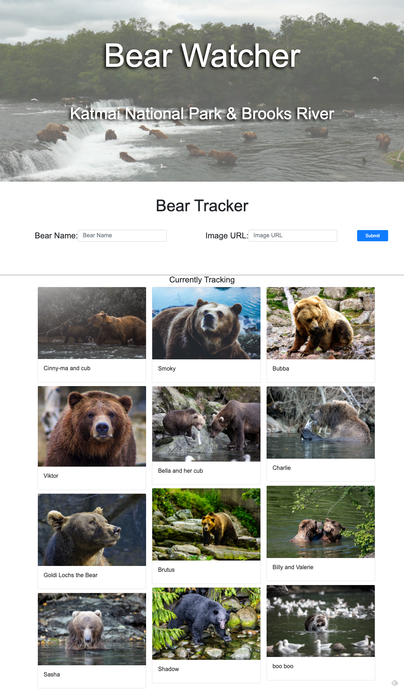
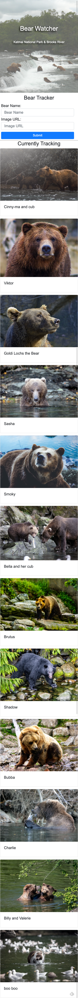

# bear-watcher

Project for NSS: https://github.com/nss-evening-cohort-12/e12-homework/blob/master/week08.md

## Instructions

Each year between July and September brown bears in the Katmai National Park congregate along the Brooks River. This river is one of the main rivers that Sockeye Salmon swim up to spawn. The brown bears wait in the shallows of the river and catch the salmon as they jump over rocks.

You have been tasked with creating a site scientists and park ranger can use to track these bears.

## Requirements

1. Use Bootstrap4 for styling

2. Use ES6 Modules

3. Project should have 2 modules - bearForm and river

- bearForm - should be the form
- river - should display all the bears

## User Stories

- As a user, when the page loads, I should see a bootstrap form that allows me to enter in a bear name and image url for a new bear.
- As a user, when I click the submit button on the new bear form a bear should be added to the page.
- As a user, when there are bears that are being tracked (ie after I have added one), I should see all their information displayed on a card.

## Screenshot of initial requirements fulfilled

**Standard Desktop Resolution**

**iPhone 6/7/8 Plus Version**

